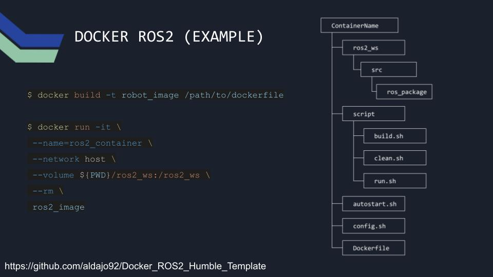

# ROS2 DOCKER UI (Humble, Gazebo classic)

This Docker project simplifies the use of ROS2 by reducing the effort required to install the necessary dependencies for working with robotics.

The ROS2 workspace for this project is located in the [`ros2_ws`](./ros2_ws) directory, which is shared with the Docker container.



## Installation

### Debian based distributions
Execute the following commands:
```
curl -fsSL https://get.docker.com -o get-docker.sh
sudo sh get-docker.sh

sudo groupadd docker # its ok if this line fails
sudo usermod -aG docker $USER

newgrp docker
sudo systemctl restart docker.service

# check docker installation
docker run hello-world
```

Then get this repository:

```
cd ~
git clone https://github.com/aldajo92/ROS2_Docker_UI.git

# open in vscode (optional)
code ~/ROS2_Docker_UI

# Build the container
cd ~/ROS2_Docker_UI # <- make sure you are in this folder
./scripts/build.sh
```

## Docker Container Commands
To run the docker container, use the following command:

- First build the docker image:
    ```bash
    ./scripts/build.sh
    ```

- Then run the docker container:
    ```bash
    ./scripts/run.sh
    ```
- Optional: Open a new terminal for the container:
    ```bash
    ./scripts/bash.sh
    ```

# Custom Alias Commands for ROS2

The following are custom alias commands designed to streamline various operations in the ROS2 project:

- **`$ bros2`**  
  A custom alias to build the ROS2 project. This command compiles the project's source code and prepares it for execution.

- **`$ sros2`**  
  This command sources the ROS2 setup script, setting up the environment variables needed to run ROS2.

## Create a ROS2 Package
Based on the [ROS2 tutorial](https://docs.ros.org/en/humble/Tutorials/Beginner-Client-Libraries/Creating-Your-First-ROS2-Package.html) use the following commands to create a new package in the [`ros2_ws/src`](./ros2_ws/src) folder:

```bash
# once inside the docker container move to src directory in the workspace
cd ~/ros2_ws/src
```

```bash
ros2 pkg create --build-type ament_cmake ros_example_package
```

Build the workspace:
```bash
colcon build
```

Source the workspace:
```bash
source ~/ros2_ws/install/setup.bash
```

Then you can edit the package files in the `~/ros2_ws/src/ros_example_package` directory using visual studio code or any other editor. For this project, vscode is assumed as the editor.

## Tutorials From ROS2 Documentation

- [Writing a simple publisher and subscriber (C++)] (https://docs.ros.org/en/humble/Tutorials/Beginner-Client-Libraries/Writing-A-Simple-Cpp-Publisher-And-Subscriber.html)
- [Understanding ROS2 Nodes] (https://docs.ros.org/en/humble/Tutorials/Beginner-CLI-Tools/Understanding-ROS2-Nodes/Understanding-ROS2-Nodes.html)

## Useful Commands

- To list all the nodes in the system:
    ```bash
    ros2 node list
    ```
- To list all the topics in the system:
    ```bash
    ros2 topic list
    ```
- To view the tf tree:
    ```bash
    ros2 run tf2_tools view_frames.py
    ```
- To view the tf tree in real-time:
    ```bash
    ros2 run tf2_tools tf2_echo
    ```
- To view the nodes and topics in real-time:
    ```bash
    ros2 run rqt_graph rqt_graph
    ```
- To view the messages being published on a topic:
    ```bash
    ros2 topic echo /topic_name
    ```

# Author

[Alejandro Daniel José Gómez Flórez](linkedin.com/in/aldajo92)

# License
This project is licensed under a custom license. See the [LICENSE](./LICENSE) file for details.

### Summary
- You may use this code for academic or personal purposes.
- Proper credit must be given to the author, Alejandro Daniel José Gómez Flórez.
- Commercial use requires explicit written permission.
- Redistribution is allowed for academic or personal purposes only.
